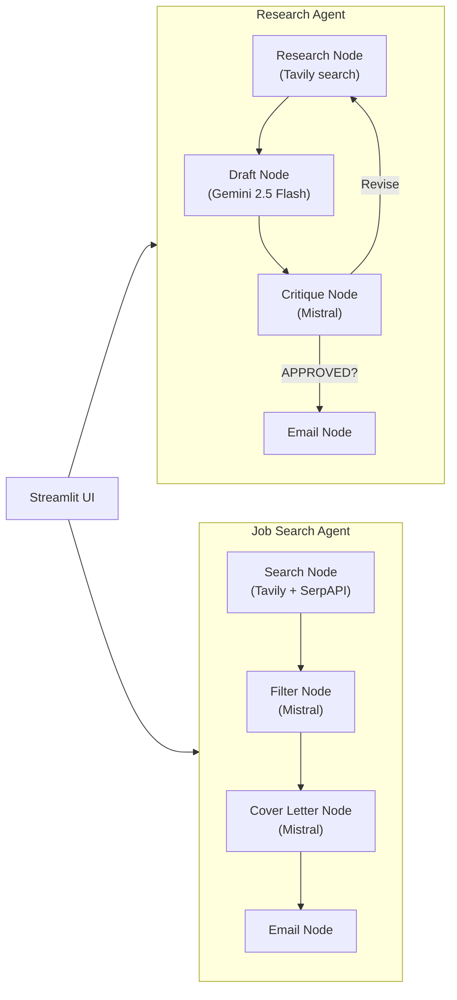

<p align="center">
  
</p>

<p align="center">
  <a href="https://deep-agent-pwjbnjxvu8wbvn8etxdgfz.streamlit.app/" target="_blank">
    
  </a>
</p>

<p align="center">
  <a href="#features">Features</a> ·
  <a href="#architecture">Architecture</a> ·
  <a href="#quick-start">Quick Start</a> ·
  <a href="#usage">Usage</a> ·
  <a href="#project-structure">Structure</a> ·
  <a href="#comparison">Comparison</a>
</p>

<p align="center">
  
  
  
  
  
  
  
</p>

---

Two autonomous LangGraph agents — one for research, one for job search. Both can email results.

## Features

- **Research Agent** — Tavily web search → draft report → AI critique → revision loop → email
- **Job Search Agent** — Tavily + SerpAPI job search → AI shortlist → cover letters → email
- **Revision Loop** — Research agent critiques its own draft and re-researches up to 2 times
- **Dual Search** — Job agent queries Tavily (web) + SerpAPI (Google Jobs) simultaneously
- **Smart Filtering** — Regex-based noise removal (aggregators, social media, salary pages)
- **Email Delivery** — Both agents send results via SMTP (Gmail)

## Architecture



| Component | Research Agent | Job Search Agent |
|---|---|---|
| **Search** | Tavily | Tavily + SerpAPI (Google Jobs) |
| **Generator** | Gemini 2.5 Flash | Mistral Small |
| **Critic** | Mistral Small | — |
| **Loop** | Up to 2 revisions (conditional) | Linear |
| **Output** | Markdown report + email | Shortlist + cover letters + email |

## Quick Start

```bash
git clone https://github.com/kairav7220/deep-agent.git
cd deep-agent
pip install -r requirements.txt
```

Set your API keys in `.env`:

```env
TAVILY_API_KEY="tvly-..."
SERPAPI_KEY="..."
GOOGLE_API_KEY="AIza..."
MISTRAL_API_KEY="..."
EMAIL_ADDRESS="your@gmail.com"
EMAIL_PASSWORD="app-password"
```

```bash
streamlit run app.py
```

## Usage

```bash
streamlit run app.py   # Launch UI
python research_agent.py "What is LangGraph?"  # CLI mode
python job_agent.py                            # CLI mode
```

## Comparison

| Feature | DeepAgent | Basic LangGraph Agent | Manual Research |
|---|---|---|---|
| Agents | 2 (research + job) | 1 | — |
| Search Sources | Tavily + SerpAPI | Single | Manual |
| Self-Critique Loop | ✅ Up to 2 revisions | ❌ | — |
| Email Reports | ✅ SMTP | ❌ | — |
| Cover Letters | ✅ AI-generated | ❌ | — |
| Smart Job Filtering | ✅ Regex + LLM | ❌ | — |
| UI | ✅ Streamlit | ❌ CLI only | — |

## Project Structure

```
deep-agent/
├── app.py               # Streamlit UI (research + job tabs)
├── research_agent.py    # LangGraph research agent (4 nodes + revision loop)
├── job_agent.py         # LangGraph job search agent (4 nodes)
├── requirements.txt     # Python dependencies
├── CONTRIBUTING.md      # Contribution guide
├── llms.txt             # AI assistant context
├── .gitignore
└── LICENSE              # MIT
```

## License

MIT © [kairav7220](https://github.com/kairav7220)

---

<p align="center">
  Built with <a href="https://langchain-ai.github.io/langgraph">LangGraph</a> ·
  <a href="https://tavily.com">Tavily</a> ·
  <a href="https://serpapi.com">SerpAPI</a> ·
  <a href="https://ai.google.dev/gemini-api">Gemini</a> ·
  <a href="https://mistral.ai">Mistral</a>
</p>
